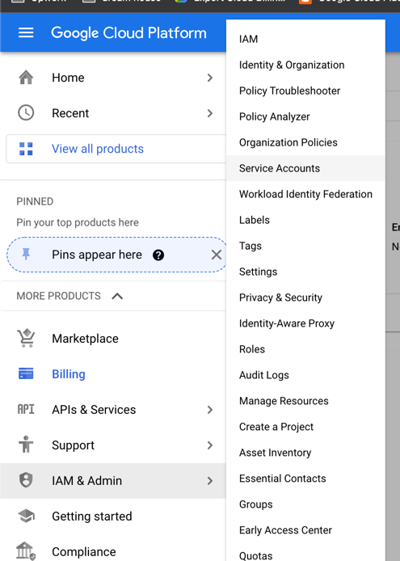

# GCP Billing/Costing API POC
This POC demonstrates how to query billing records from GCP.

# Getting Started

## The following steps you will probably use Google console 
- Create Billing Account, follow this instruction from google documentation https://cloud.google.com/billing/docs/how-to/manage-billing-account
- Export Cloud Billing to Bigquery, follow this instructions https://cloud.google.com/billing/docs/how-to/export-data-bigquery
- Once Done it will take few moments for google to create the bigquery table and once create it would look like this

- This Query you can use to stream all details into client,
```
SELECT * FROM `psyched-elixir-345100.project_costing.gcp_billing_export_resource_v1_01BFDE_7D4554_88DBC4`
WHERE DATE(_PARTITIONTIME) = DATE_SUB(CURRENT_DATE(), INTERVAL 1 DAY)
LIMIT 100;
```
- This Query you can use to create a summary of total cost for each month
```
SELECT
 invoice.month,
 (SUM(CAST(cost * 1000000 AS int64))
   + SUM(IFNULL((SELECT SUM(CAST(c.amount * 1000000 as int64))
                 FROM UNNEST(credits) c), 0))) / 1000000
   AS total_exact
FROM `psyched-elixir-345100.project_costing.gcp_billing_export_resource_v1_01BFDE_7D4554_88DBC4`
GROUP BY 1
ORDER BY 1 ASC;
```
- Next you will need to create a service account so that you can access billing from your application, follow the documentation
  https://cloud.google.com/iam/docs/creating-managing-service-accounts
- Next is to assign iam roles to the newly created service account, since bigquery is what we will access please refer this documentation - 
  about bigquery iams - https://cloud.google.com/bigquery/docs/access-control, you will need to assign `roles/bigquery.jobUser`
  to the service account you created at project level.
- Once Done, you have to create the json key, go to service accounts<br/>

- click on manage keys<br/>

- create new key<br/>

- create json file<br/>

- it will download the json file and that will be used for your consuming application.

## How to Run? This part will be consuming the reports from BigQuery
- Make sure you set the envoronment variable `GOOGLE_APPLICATION_CREDENTIALS=your-service-account-key.json`
- `./gradlew bootRun` from root project. 
- it will print basic total cost for each month used. 


# Support?
you can reach out to the git repo owner or email me at ortizmark905@gmail.com, you can also look for me from linked in and upwork.


